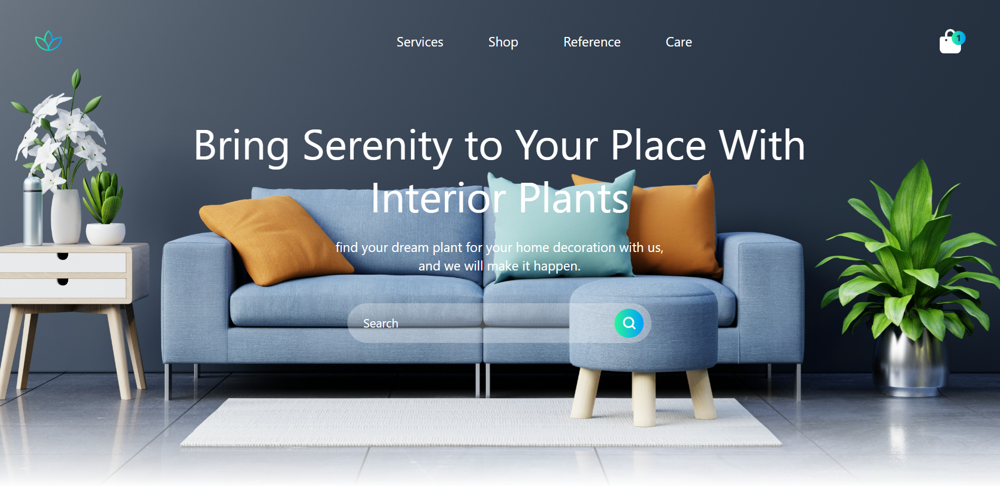

# BloomSpace Furniture Store

Welcome to BloomSpace Furniture Store! This project is a responsive website for a furniture store built using React and Tailwind CSS.

## Description

BloomSpace offers a variety of high-quality furniture to enhance your living spaces. The website is designed to be responsive and features a navigation bar for easy exploration. Additionally, animations have been incorporated to create an engaging user experience.

## Preview

## Features

- Responsive design for optimal viewing on various devices.
- Navigation bar for seamless navigation through the website.
- Animated elements to enhance the user interface.

## Usage

1. Explore the [BloomSpace Furniture Store](https://keya161.github.io/BloomSpace_furniture/) website.
2. Use the navigation bar to browse different categories and products.
3. Experience the animations on various elements for a visually appealing interaction.

## Technologies Used

- React
- Tailwind CSS

## Acknowledgments

This project was created to showcase the use of React and Tailwind CSS in building a responsive and visually appealing furniture store website.

Feel free to explore the codebase and provide feedback or suggestions!

